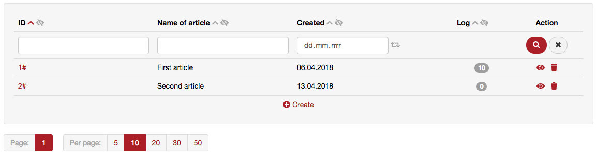

# EntityGrid
Used for creating entity grids with search form and detail form. Designed for **Nette** and **Nette Database Explorer**.

## Features:
* Pagination
* Per page selection
* Search (in grid - for every column of item)
* Hide/Show selected columns
* Order (by every column of item, even if it's related value)
* Add/Edit/Delete rows
* Ajax behavior
* Optional form renderer (for example Bootstrap)

##### Preview:


## Extra requirements:
Font Awesome is required to render SVG icons
* Font Awesome: ~ v5

## Installation
1. Install via composer 
    * `composer require jax-p/entity-grid`
    * `composer install`
2. Create component in presenter
    ```
    /**
     * @return EntityGrid
     */
    protected function createComponentEntityGrid() {
        $control = new EntityGrid($this->model, $this->grid_options, $this->_session);
        return $control;
    }
    ```
3. Call the component in template (renders grid)
    ```
    {control entityGrid $page}
    ```
4. Call the components detail in template (renders edit form) *(optional)*
    ```
    {control entityGrid:detail $item}
    ```